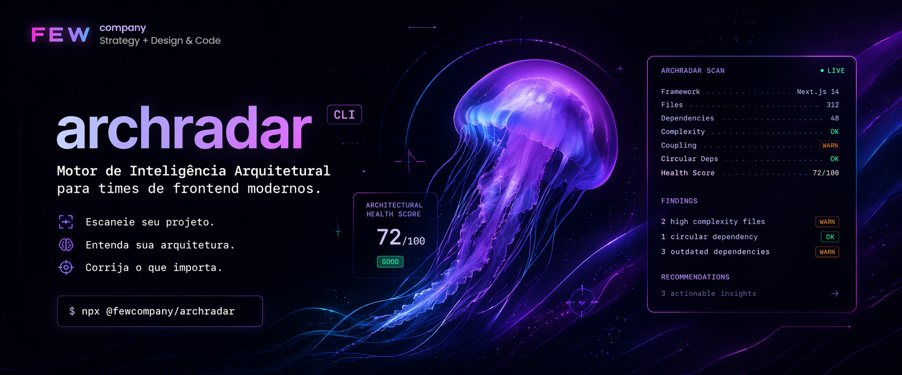
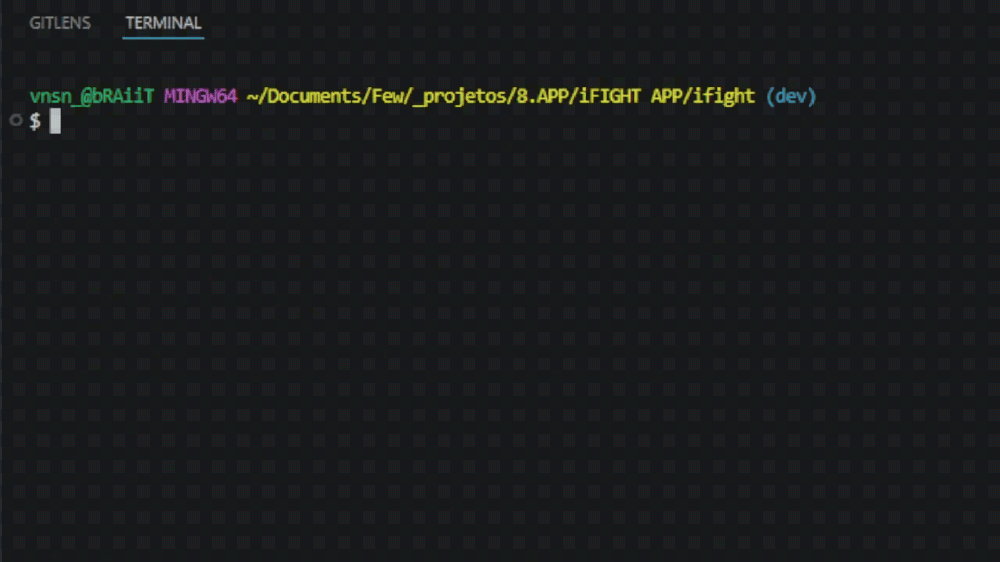

# archradar

<p align="center">
  
</p>

<p align="center">
  <strong>Motor de Inteligência Arquitetural para times de frontend modernos.</strong>
</p>

<p align="center">
  Escaneie seu projeto. Entenda sua arquitetura. Corrija o que importa.<br />
  Por <a href="https://fewcompany.com">Few Company</a>
</p>

<p align="center">
  <a href="https://www.npmjs.com/package/@fewcompany/archradar">
    
  </a>
  <a href="https://www.npmjs.com/package/@fewcompany/archradar">
    
  </a>
  <a href="./LICENSE">
    
  </a>
  
  
</p>

<p align="center">
  
  
  
  
  
  
</p>

---

## O que é

**ArchRadar** é uma CLI open source que analisa a arquitetura de projetos frontend e entrega um diagnóstico técnico com:

- score de saúde arquitetural
- detecção de risco
- análise de complexidade
- acoplamento entre módulos
- dependências circulares
- saúde das dependências
- recomendações práticas de refatoração

Sem setup.  
Sem config.  
Sem firula.

Você roda.  
Ele escaneia.  
Você entende o que está torto.

---

## O que ele faz

### 1. Detecta seu stack
Identifica automaticamente o framework e o contexto do projeto:

- React
- Next.js
- Vite
- Vue
- Angular
- Svelte

### 2. Mede saúde arquitetural
Gera um **Architectural Health Score** de **0 a 100** com base em sinais reais da estrutura do projeto.

### 3. Analisa complexidade
Usa AST para identificar arquivos e módulos com alta complexidade ciclomática.

### 4. Mapeia acoplamento
Mostra onde seu projeto está excessivamente conectado e mais difícil de manter.

### 5. Detecta dependências circulares
Encontra ciclos entre arquivos e módulos que tendem a gerar bugs, confusão e dívida técnica.

### 6. Avalia dependências
Verifica bibliotecas:

- desatualizadas
- não utilizadas
- potencialmente arriscadas

### 7. Gera recomendações acionáveis
Nada de "seu projeto está ruim" e sumir.
Ele aponta o que corrigir primeiro.

---

## Preview

<p align="center">
  
</p>

---

## Output

```
╭──────────────────────────────────────────╮
│  ARCHRADAR — Architectural Intelligence  │
│  by Few Company                          │
╰──────────────────────────────────────────╯

  Project:   meu-app
  Framework: Next.js 14
  Files:     312
  Avg lines: 98
  Total deps: 48

  ─────────────────────────────────────────
  ARCHITECTURAL HEALTH SCORE
  ─────────────────────────────────────────

  ██████████░░░░░░░░░░  52/100  [C]

  Risk Level: HIGH
  Intervention needed. Accumulated technical debt.

  ─────────────────────────────────────────
  FINDINGS
  ─────────────────────────────────────────

  ⚠  12 critical file(s) (>300 lines)
  ✓  No circular dependencies
  ⚠  High complexity: SignupForm (score 122)
  ⚠  4 file(s) with high coupling (>15 imports)

  ─────────────────────────────────────────
  RECOMMENDATIONS
  ─────────────────────────────────────────

  1. 12 file(s) above 300 lines. Consider splitting into smaller modules.
  2. High cyclomatic complexity in "SignupForm". Extract smaller functions.
  3. Reduce inter-module dependencies in coupling hotspots.

  ─────────────────────────────────────────
  Deep analysis: fewcompany.com/radar
  ─────────────────────────────────────────
```

---

## Instalação

```bash
npm install -g @fewcompany/archradar
```

Ou rode sem instalar:

```bash
npx @fewcompany/archradar
```

---

## Uso

Rode dentro de qualquer projeto frontend:

```bash
archradar
```

### Comandos

```bash
archradar scan           # Scan arquitetural completo (padrão)
archradar scan --json    # Saída em JSON
archradar --version      # Versão
archradar --help         # Ajuda
```

---

## Requisitos

- Node.js >= 20.0.0

---

## English Summary

**archradar** is a free CLI tool that scans your frontend project's architecture and gives you a health score from 0 to 100 with actionable recommendations.

```bash
npx @fewcompany/archradar
```

**What it does:**
- Detects your framework and stack (React, Next.js, Angular, Vue, Svelte)
- Analyzes cyclomatic complexity via AST
- Maps circular dependencies
- Measures coupling density between modules
- Checks dependency health (outdated, unused, high-risk)
- Scores your architecture 0–100 with specific recommendations

No config needed. Just run it.

Built with TypeScript + ts-morph · License: AGPL-3.0 · by [Few Company](https://fewcompany.com)
